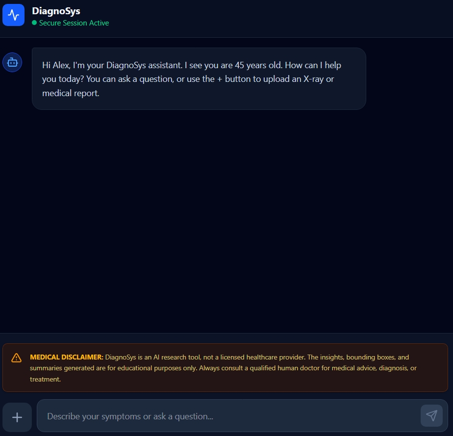
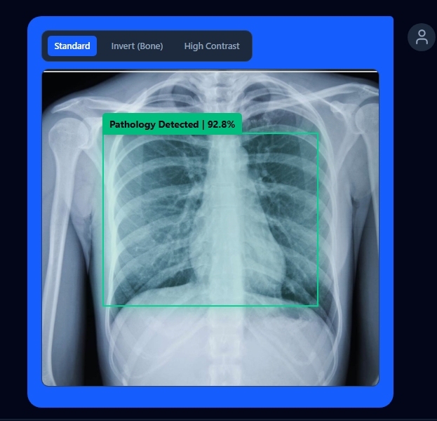
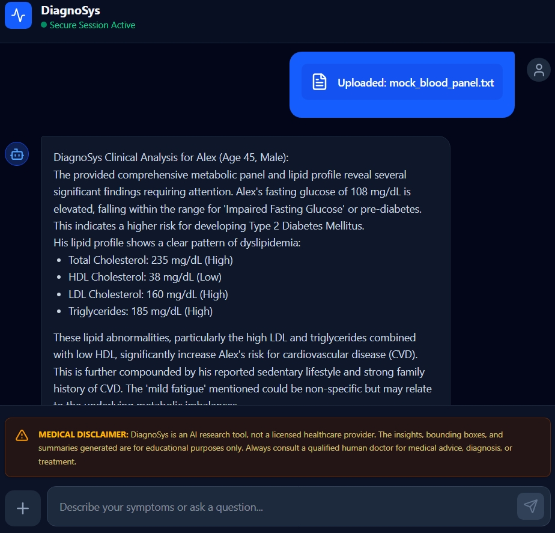
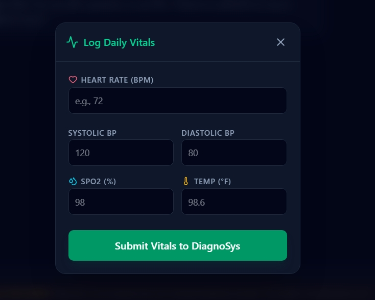
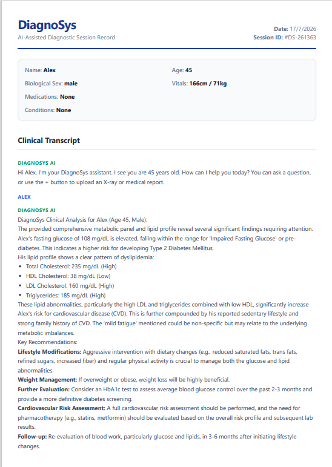
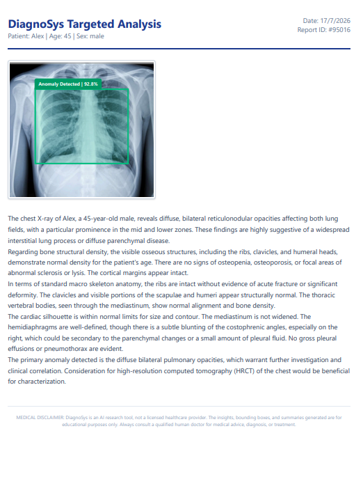

# DiagnoSys: Multimodal AI Healthcare Framework


## 📌 Abstract
**DiagnoSys** is an advanced, full-stack digital health framework designed to explore the integration of Large Language Models (LLMs) and Computer Vision within clinical environments. The system processes multimodal inputs—including natural language, structured physiological data, and complex medical imagery—to deliver highly contextualized, formatted diagnostic insights. 

This repository serves as a comprehensive demonstration of applied generative AI, showcasing spatial reasoning techniques, strict schema enforcement for LLM outputs, and real-time frontend data binding.

---

## 📑 Table of Contents
1. [System Architecture & Technology Stack](#-system-architecture--technology-stack)
2. [Core Capabilities & Visual Documentation](#-core-capabilities--visual-documentation)
3. [Underlying Mechanics & Data Flow](#-underlying-mechanics--data-flow)
4. [Local Installation & Deployment](#-local-installation--deployment)
5. [Future Scope](#-future-scope)

---

## 🏗️ System Architecture & Technology Stack

The application utilizes a decoupled architecture, separating the client-side presentation layer from the neural processing backend to ensure high performance, security, and scalability.

| Component | Technology | Role & Implementation Details |
| :--- | :--- | :--- |
| **Frontend Framework** | React.js (Vite) | Component-driven UI ensuring rapid state management and seamless DOM updates during real-time AI inference. |
| **react-to-print** | React.js (Vite) | For crash-proof, zero-latency DOM-to-PDF generation without blocking the main JavaScript thread. |
| **Styling & UI** | Tailwind CSS | Utility-first CSS framework utilized to design a responsive, accessible, and clinical dark-themed interface. |
| **Backend API** | FastAPI (Python) | High-throughput, asynchronous RESTful API responsible for routing multimodal payloads to the AI engine. |
| **Neural Engine** | Google Gemini 1.5 | State-of-the-art multimodal LLM handling Natural Language Processing (NLP), Optical Character Recognition (OCR), and Spatial Reasoning. |
| **Data Parsing** | React-Markdown | Dynamic rendering engine used to convert raw AI markdown into structured, highly readable clinical summaries. |

---

## 🚀 Core Capabilities & Visual Documentation

### 1. The Clinical Dashboard (Conversational UI)
The primary interface acts as a secure conversational agent. It features dynamic message routing, animated neural scanning states, and strict safety guardrails that frame the AI's responses as analytical assistance rather than definitive medical diagnoses.


<br>
<i>> Figure 1: The main DiagnoSys dashboard showcasing the conversational UI, patient context tracking, and markdown-formatted AI responses.</i>

### 2. Spatial Diagnostics & Radiology Module
By leveraging the spatial reasoning capabilities of the multimodal engine, the system analyzes medical imagery (e.g., X-rays, MRIs). Upon detecting a pathology, the backend generates probabilistic coordinates, which the frontend translates into a precise CSS-based bounding box overlay.


<br>
<i>> Figure 2: The Radiology Module actively highlighting a detected opacity. Note the integrated radiology toolbar allowing for dynamic image manipulation (Inversion, High Contrast).</i>

### 3. Automated Clinical Report Parsing (NLP/OCR)
The system acts as an intelligent parsing engine, extracting unstructured data from uploaded medical text files or PDFs. It autonomously evaluates metabolic panels, cross-references values against standard clinical ranges, and highlights critical biomarkers.


<br>
<i>> Figure 3: Structured extraction of a patient lipid profile, demonstrating context-aware discrepancy detection and risk analysis.</i>

### 4. Real-Time Vitals Telemetry
A dedicated interactive modal enables the logging of daily physiological parameters. This structured data is instantly compiled into a contextual prompt, allowing the AI to identify dangerous trends in vitals such as blood pressure or oxygen saturation.


<br>
<i>> Figure 4: The Vitals Input Interface, featuring client-side validation and immediate data pipeline routing to the AI engine.</i>

### 5. Enterprise-Grade PDF Reporting
Utilizes the browser's native print engine to generate high-resolution, hospital-style Electronic Health Records (EHR).

* **Full Session Export:** Download the entire clinical transcript, including patient context, vitals, and all medical image analyses.
<br>


* **Targeted Diagnostic Export:** Instantly export a specific AI analysis, perfectly capturing the original uploaded scan complete with the AI-generated bounding box overlay and confidence score.
<br>


* **Smart Modality Routing:** Intelligently differentiates between medical imaging (X-Ray, MRI, PET) and text-based documents (Lab Reports, Blood Panels) to prevent modality hallucinations.
* **Robust Load Balancing & Error Handling:** Built-in safeguards that catch API rate limits (HTTP 429) and render graceful "Server Cooldown Active" messages in the UI, ensuring the application never crashes during live high-traffic demonstrations.
---

## ⚙️ Underlying Mechanics & Data Flow

DiagnoSys relies on advanced prompt engineering and strict schema enforcement to bridge the gap between generative text and programmatic UI rendering.

### The Spatial Bounding Box Pipeline
1. **Multimodal Ingestion:** An image file is uploaded via React and transmitted alongside a strictly engineered prompt to the FastAPI backend.
2. **Strict JSON Forcing:** The system prompt forces the LLM to abandon standard text generation and return a strict JSON payload. The AI calculates the position of the anomaly and returns proportional coordinates (0-100%).
3. **Data Extraction:** The Python backend safely parses the raw JSON string:
   ```json
   {
     "reply": "Clinical analysis text...",
     "box": {"top": 30, "left": 40, "width": 25, "height": 20},
     "confidence": 98.5
   }
   ```
4. **Dynamic Frontend Rendering:** The React interface catches the `box` object and dynamically injects the coordinates into an absolute-positioned CSS `<div>`, mapping the AI's spatial awareness directly onto the user's screen.
5. **Off-Screen Print Rendering:** To maintain a sleek, dark-mode UI while generating pristine white-background clinical reports, the PDF templates are rendered dynamically in off-screen DOM nodes. This allows the `react-to-print` hook to capture high-fidelity documents without interfering with the user's visual experience.
---

## 💻 Local Installation & Deployment

### Prerequisites
* **Node.js** (v18.x or higher recommended)
* **Python** (v3.9 or higher)
* A valid Google Gemini API Key.

### 1. Clone the Repository
```bash
git clone [https://github.com/yourusername/ai-health-companion.git](https://github.com/yourusername/ai-health-companion.git)
cd ai-health-companion
```

### 2. Backend Environment Setup
```bash
cd backend
python -m venv .venv

# Activate the virtual environment
# Windows:
.venv\Scripts\activate
# Mac/Linux:
source .venv/bin/activate

# Install dependencies
pip install fastapi uvicorn google-generativeai python-multipart pillow python-dotenv
```

### 3. Secure Configuration
Create a `.env` file within the `backend` directory and securely insert your API key:
```env
GEMINI_API_KEY=your_api_key_here
```

### 4. Bootstrapping the Servers
**Start the Backend API (Terminal 1):**
```bash
cd backend
uvicorn main:app --reload
```

**Start the Frontend Client (Terminal 2):**
```bash
cd frontend
npm install
npm install react-markdown
npm run dev
```
Access the application locally via your browser at `http://localhost:5173/`.

---

## 🔬 Research & Development
*Developed as an academic exploration into applied Generative AI, computer vision, and modern full-stack engineering principles by Aashi Pandey*